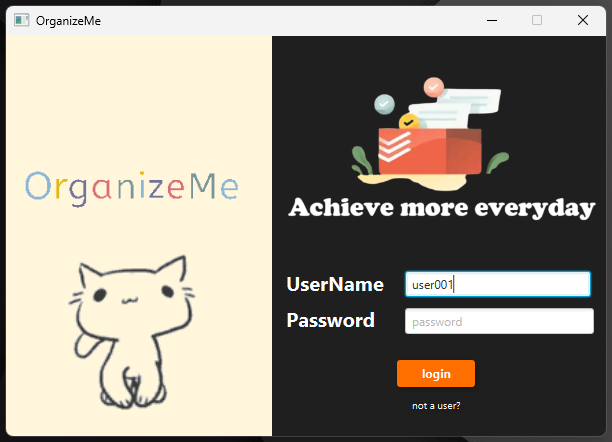
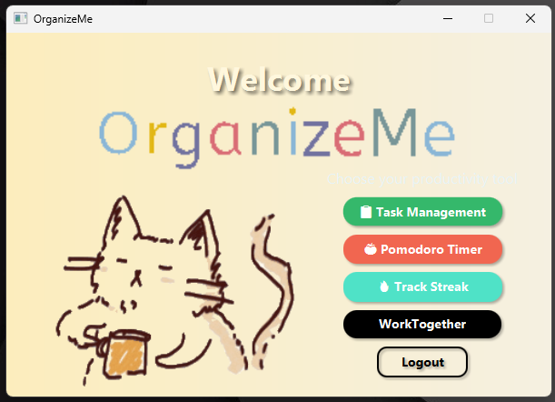

# 🎯 OrganizeMe

<div align="center">

### *Your Ultimate Productivity Companion*

A powerful JavaFX-based task management system designed to supercharge your productivity and keep your team in sync.


[📥 Download](#-installation) • [✨ Features](#-features) • [🚀 Quick Start](#-quick-start)

</div>

---

## 🌟 What Makes OrganizeMe Special?

OrganizeMe isn't just another task manager—it's a complete productivity ecosystem built from the ground up with modern development practices. Whether you're a solo developer tracking personal projects or a team collaborating on the next big thing, OrganizeMe delivers top-notch features that are fully functional and ready to boost your productivity.

---

## 📸 Application Preview

<p align="center">
  
  
</p>
<p align="center">
  <em>Login Page</em>&nbsp;&nbsp;&nbsp;&nbsp;&nbsp;&nbsp;&nbsp;&nbsp;&nbsp;&nbsp;&nbsp;&nbsp;&nbsp;&nbsp;&nbsp;&nbsp;&nbsp;&nbsp;&nbsp;&nbsp;&nbsp;&nbsp;&nbsp;&nbsp;&nbsp;&nbsp;&nbsp;&nbsp;&nbsp;&nbsp;&nbsp;&nbsp;&nbsp;&nbsp;&nbsp;&nbsp;&nbsp;&nbsp;&nbsp;&nbsp;&nbsp;&nbsp;&nbsp;&nbsp;&nbsp;&nbsp;&nbsp;&nbsp;&nbsp;&nbsp;&nbsp;&nbsp;&nbsp;&nbsp;&nbsp;&nbsp;&nbsp;&nbsp;&nbsp;&nbsp;&nbsp;&nbsp;&nbsp;&nbsp;&nbsp;&nbsp;&nbsp;&nbsp;&nbsp;&nbsp;&nbsp;&nbsp;&nbsp;&nbsp;&nbsp;&nbsp;<em>Menu</em>
</p>

---

## ✨ Features

### 📝 **Smart Task Management**
- **Add & Organize Tasks** - Create tasks with a clean, intuitive interface
- **Priority System** - Mark tasks as high, medium, or low priority
- **Easy Sorting** - Filter and sort tasks by priority, deadline, or custom criteria
- **Smart Scheduler** - Plan your day, week, or month with an integrated scheduling system

### 🎯 **Productivity Boosters**
- **Pomodoro Timer** - Built-in focus timer to maintain peak productivity
- **Streak Tracking** - Gamify your workflow and maintain daily consistency
- **Multi-Project Support** - Juggle multiple projects without breaking a sweat

### 👥 **Team Collaboration**
- **Real-time Messenger** - Communicate with your team without leaving the app
- **Group Project Management** - Coordinate team efforts on shared projects
- **Multi-Device Access** - Work seamlessly across all your devices

### 🔧 **Technical Excellence**
- **Advanced Networking** - Robust client-server architecture
- **Multithreading** - Smooth, responsive UI that never freezes
- **Clean Interface Design** - Intuitive JavaFX-powered user experience
- **Efficient Navigation** - Get where you need to go with minimal clicks

---

## 🚀 Quick Start

### Prerequisites

**OrganizeMe requires Java JDK 25 or higher.** 

👉 **[Download Java JDK 25 Installer Here](https://drive.google.com/drive/folders/1LzDzB79e_5XJJfGJMWMaYd5IdkqgPUbr?usp=drive_link)**

### 📥 Installation

1. **Clone the Repository**
   ```bash
   git clone https://github.com/TJ-Paul/OrganizeMe-JavaFX.git
   cd OrganizeMe-JavaFX
   ```

2. **Verify Java Installation**
   ```bash
   java --version
   ```
   Make sure you see Java 25 or higher.

3. **You're Ready to Go!** 🎉

---

## 🎮 Running OrganizeMe

### For Solo Use

Simply double-click **`Run.bat`** and start organizing!

### For Team Collaboration

#### Setting Up the Server (Host Device):
1. Double-click **`Server.bat`** on one device (this will be your host)
2. The server will start and be ready to accept connections

#### Connecting as a Team Member:
1. On the host device, open Terminal/Command Prompt
2. Type `ipconfig` and press Enter
3. Look for and copy the **IPv4 Address** (e.g., 192.168.1.100)
4. Share this IP address with your team members
5. Team members should run **`Run.bat`** and enter the provided IP address
6. **Enjoy seamless team collaboration!** 🚀

---

## 💡 Usage Tips

### Getting Started
1. **Create Your First Project** - Click the "New Project" button to get started
2. **Add Tasks** - Break down your project into manageable tasks
3. **Set Priorities** - Mark important tasks so they stand out
4. **Start a Pomodoro** - Use the built-in timer to focus on high-priority work
5. **Build Your Streak** - Complete tasks daily to maintain your productivity streak

### Team Collaboration
1. **Create a Team Project** - Invite team members to collaborate
2. **Use the Messenger** - Communicate in real-time without switching apps
3. **Assign Tasks** - Delegate work and track team progress
4. **Multi-Device Sync** - Work from anywhere, your data stays in sync

---

## 🏗️ Architecture Highlights

OrganizeMe showcases advanced software engineering concepts:

- **MVC Architecture** - Clean separation of concerns
- **Concurrent Programming** - Efficient multithreading for responsive UI
- **Network Programming** - Real-time data synchronization with client-server model
- **Event-Driven Design** - Smooth, reactive user interface
- **Database Integration** - Persistent storage of all your data

---

## 🎓 About This Project

**OrganizeMe** was developed as part of the **Level 1, Term 2** coursework at **Bangladesh University of Engineering and Technology (BUET)**, demonstrating proficiency in:

- JavaFX GUI development
- Network programming and socket communication
- Multithreading and concurrent programming
- Software architecture and design patterns
- Team collaboration tools implementation

This project is currently **under active development** while maintaining full functionality of all its top-notch features.


---

## 📞 Contact & Support

Got questions? Run into issues? We're here to help!

- 🐛 **Bug Reports**: Open an issue on [GitHub](https://github.com/TJ-Paul/OrganizeMe-JavaFX/issues)
- 💡 **Feature Requests**: We'd love to hear your ideas
- 📧 **Email**: [tjpaul770@gmail.com](mailto:tjpaul770@gmail.com)
- 💼 **LinkedIn**: [Turjjo Paul](https://www.linkedin.com/in/turjjo-paul/)

---

<div align="center">

### ⭐ If you find OrganizeMe useful, give it a star!

**Made with ❤️ using JavaFX at BUET**

*Stay organized. Stay productive. Stay ahead.*

</div>
